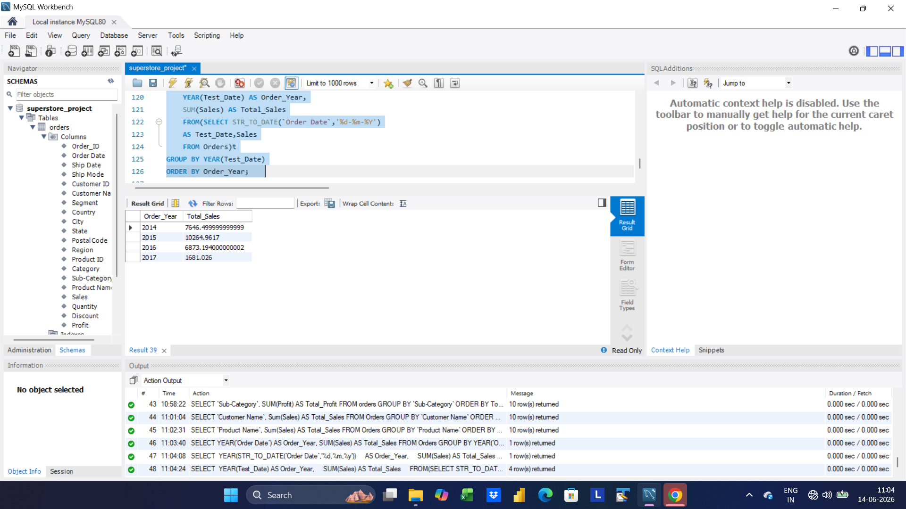
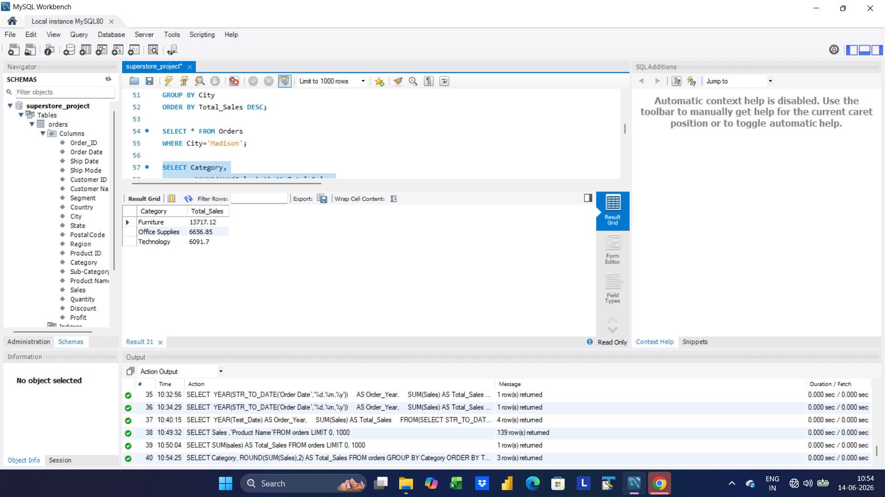
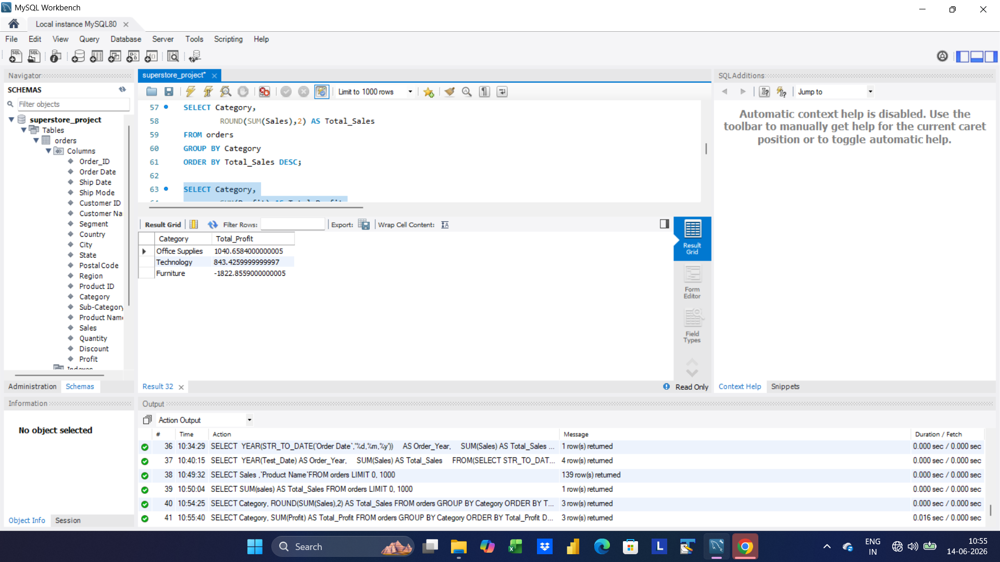
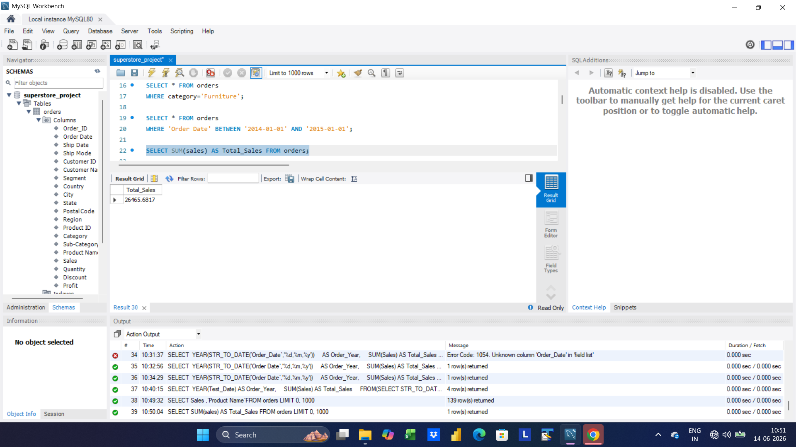
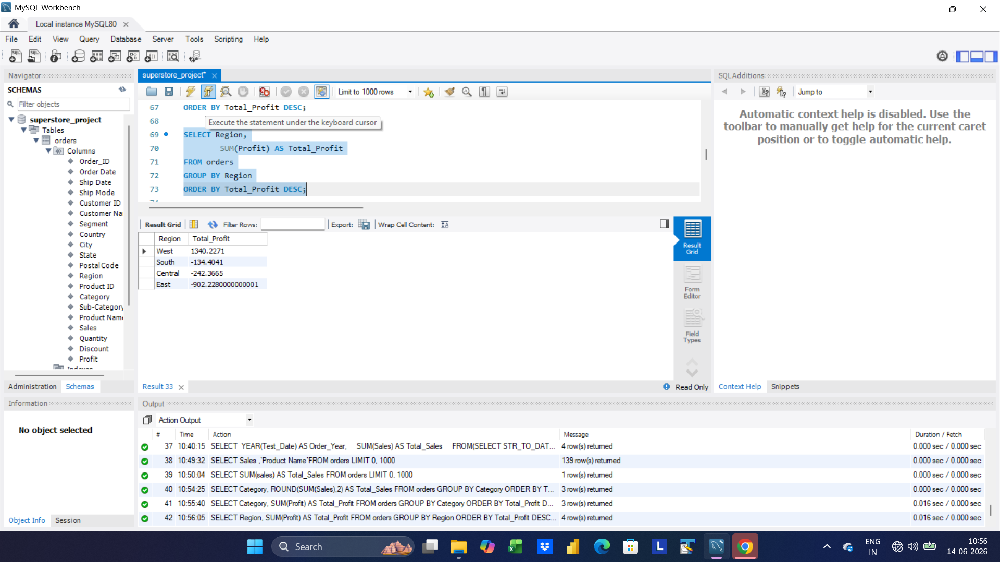
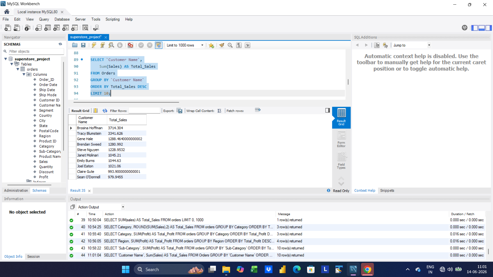
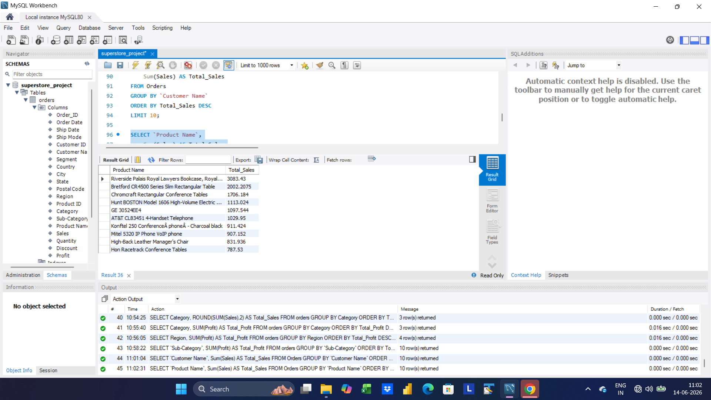

📊 Superstore Sales Analysis Using SQL

📌 Project Overview

This project focuses on analyzing retail sales data using SQL in MySQL Workbench. The objective was to extract meaningful business insights from transactional sales data by performing sales, profit, customer, product, and regional analysis.

Using SQL queries, raw business data was transformed into actionable insights that can support strategic decision-making and improve overall business performance.

---

🎯 Business Problem

Organizations generate large amounts of sales data but often struggle to answer critical business questions such as:

- Which products generate the highest revenue?
- Which categories are most profitable?
- Which regions are underperforming?
- Who are the most valuable customers?
- Which product segments are causing losses?

This project addresses these questions through structured SQL-based analysis.

---

🛠️ Tools & Technologies

- MySQL Workbench
- SQL
- CSV Dataset Import
- Data Cleaning & Transformation

---

📂 Dataset Information

Dataset: Superstore Sales Dataset

The dataset contains:

- Order Information
- Customer Details
- Product Information
- Categories & Sub-Categories
- Sales Revenue
- Profit
- Discounts
- Regional Data
- Order Dates

---

🧹 Data Preparation

Before analysis, the following preprocessing steps were completed:

- Imported CSV data into MySQL
- Renamed inconsistent column headers
- Fixed data formatting issues
- Converted text dates using "STR_TO_DATE()"
- Validated numerical columns
- Checked data quality for analysis

---

🧠 SQL Concepts Applied

Data Retrieval

- SELECT
- WHERE
- ORDER BY
- LIMIT

Aggregation & Analysis

- SUM()
- AVG()
- MIN()
- MAX()
- COUNT()

Grouping

- GROUP BY
- HAVING

Date Functions

- STR_TO_DATE()

Business Intelligence Queries

- Revenue Analysis
- Profitability Analysis
- Customer Analysis
- Regional Analysis
- Product Performance Analysis

---

📊 Analysis Performed

1️⃣ Overall Sales Analysis

Calculated total revenue generated across all orders.

2️⃣ Profit Analysis

Measured total profit and evaluated business profitability.

3️⃣ Product Performance Analysis

Identified top-selling and highest-performing products.

4️⃣ Category Analysis

Compared sales and profit performance across product categories.

5️⃣ Regional Analysis

Evaluated sales and profitability by region.

6️⃣ Customer Analysis

Identified high-value customers based on total sales contribution.

7️⃣ Sales Trend Analysis

Analyzed yearly sales performance and business growth patterns.

8️⃣ Loss-Making Segment Analysis

Identified sub-categories generating negative profits.

---

🔍 Key Findings

Sales Performance

- Total Sales: 26,465.68
- Highest Revenue Product: Riverside Palais Royal Bookcase

Profitability

- Total Profit: 61.23
- Most Profitable Category: Office Supplies
- Furniture generated high sales but lower profitability.

Loss Analysis

- Bookcases were the largest loss-making sub-category.
- Tables also contributed significantly to losses.

Regional Insights

- West region generated the highest profit.
- East region showed the weakest profitability performance.

Customer Insights

- Top Customer: Brosina Hoffman

Trend Analysis

- Sales performance peaked during 2015.

---

💡 Business Recommendations

1. Optimize Loss-Making Products

Review pricing, discounting, and operational costs for Bookcases and Tables.

2. Improve Regional Performance

Investigate profitability challenges in the East region.

3. Focus on Profitable Categories

Increase investment in high-margin categories such as Office Supplies.

4. Strengthen Customer Retention

Develop retention strategies for top-performing customers.

5. Monitor Discount Strategies

Reduce excessive discounting to protect profit margins.

---

📁 Project Files

- "superstore_sales_analysis.sql"
- "Superstore_Sales_Dataset.csv"
- Query Output Screenshots
- Project Documentation

---

🚀 Skills Demonstrated

- SQL Query Writing
- Data Cleaning
- Data Transformation
- Data Analysis
- Business Intelligence
- Exploratory Data Analysis (EDA)
- Business Problem Solving
- Insight Generation
- Database Management

---

📷 Project Preview

## 01. Total Sales by Year

## 02. Total Sales by Category

## 03. Profit by Category

## 04. Total Sales

## 05. Regional Sales Analysis

## 06. Top 10 Customers

## 07. Top 10 Products

---

🎯 Project Outcome

This project demonstrates how SQL can be used to transform raw sales data into valuable business insights. Through structured querying and analytical thinking, key opportunities for improving profitability, customer retention, and regional performance were identified.

---

👨‍💻 Author

Narendra Patil

Aspiring Data Analyst

Skills:

- SQL
- Power BI
- Excel
- Python
- Data Visualization
- Business Analytics

Connect With Me

- LinkedIn: https://www.linkedin.com/in/narendra-patil-637aa8343
- GitHub: https://github.com/narendra-p09

---
